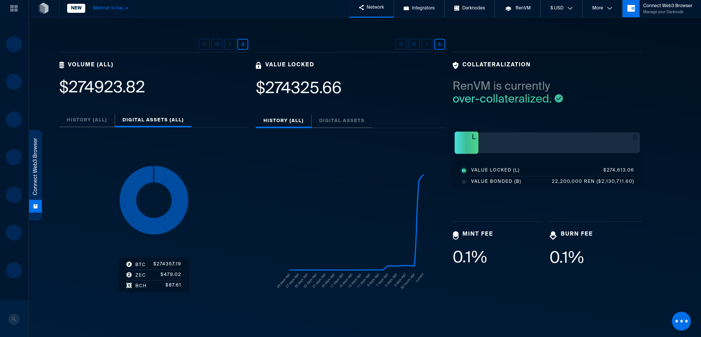
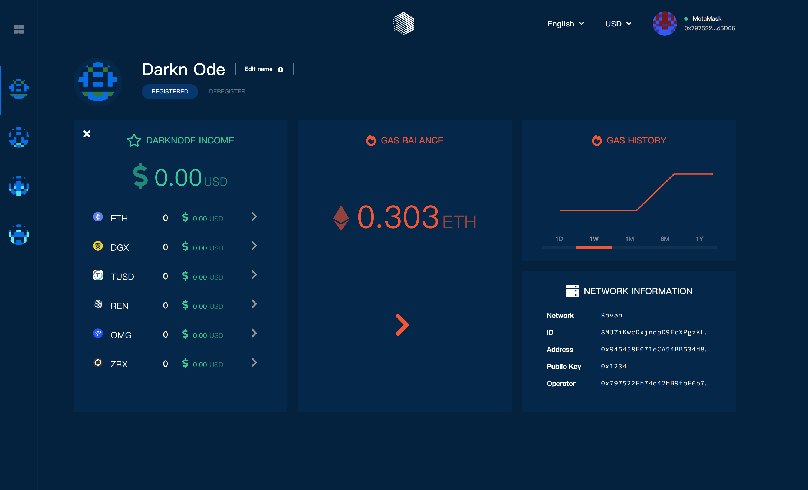

# Ren Command Center

[](https://circleci.com/gh/renproject/command-center/tree/master)

The Command Center is a dApp for registering, funding and monitoring darknodes, and for withdrawing rewards.

For instructions on running a darknode, see [Darknode Rollout: Limited Participation Begins](https://medium.com/republicprotocol/a-sdarknode-rollout-limited-participation-begins-68f51d9bb865).

## Previews

All-darknodes page



Darknode page



## Developer notes

### Project

The project is structured into [`components`](./src/components), [`store`](./src/store) and [`lib`](./src/lib).

The library (`lib`) files of note are:

* [`contractReads.ts`](./src/lib/ethereum/contractReads.ts)
* [`contractWrites.ts`](./src/lib/ethereum/contractWrites.ts)

### Tests

(see [CircleCI config](./.circleci/config.yml) for more details)

In one terminal, start a local Ethereum node by running:

```bash
cd ./node_modules/darknode-sol
yarn install
(yarn ganache-cli -d  > /dev/null &)
sleep 5
yarn truffle migrate 
```

In another, run:

```bash
yarn run test
```