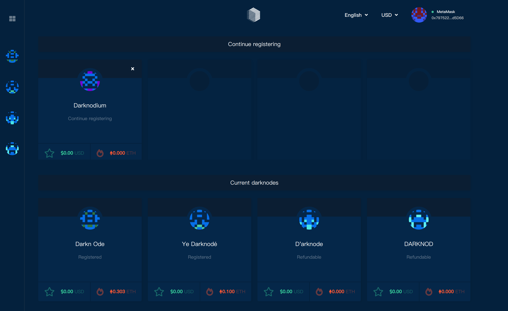

# Darknode Command Center

[dcc.republicprotocol.com](https://dcc.republicprotocol.com)

The Darknode Command Center is a dApp for registering, funding and monitoring darknodes, and for withdrawing rewards.

For instructions on running a darknode, see [Darknode Rollout: Limited Participation Begins](https://medium.com/republicprotocol/a-sdarknode-rollout-limited-participation-begins-68f51d9bb865).

## Previews

All-darknodes page

Darknode page

